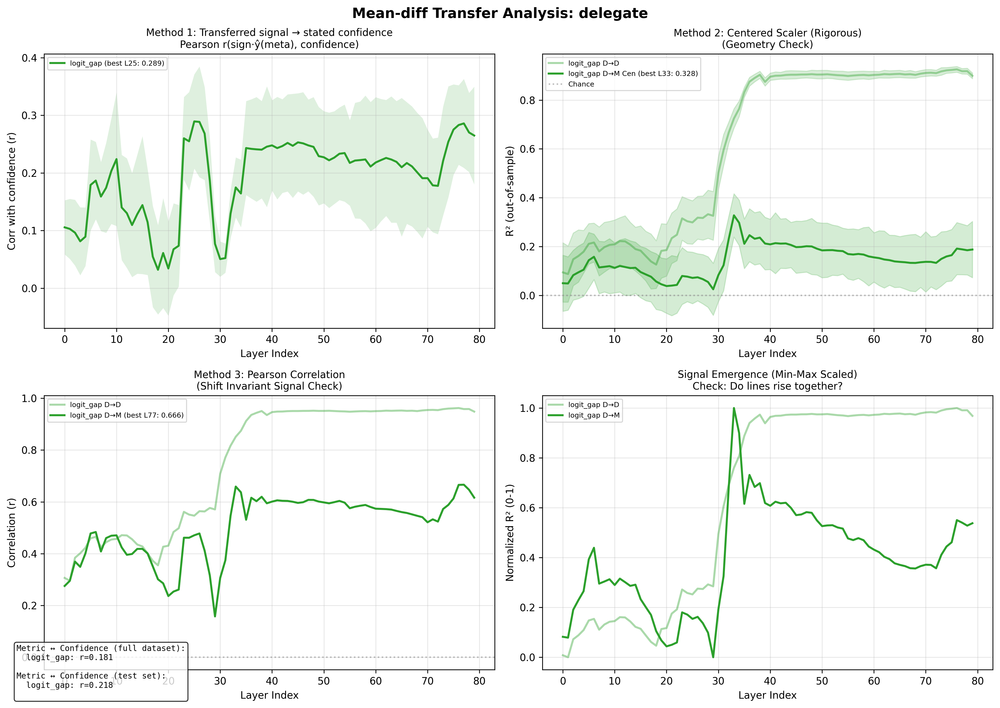

# Internal Uncertainty Representations in LLMs: Evidence from Causal Interventions

## Executive Summary

This report documents evidence that **Llama-3.3-70B-Instruct** has internal representations of its own output uncertainty. Using the **top_logit** metric and **mean_diff** direction-finding method, we find:

1. **Identification**: Activations encode output uncertainty, with R² = 0.925 at layer 39
2. **Transfer**: These representations transfer to meta-judgment tasks (R² = 0.796 for confidence)
3. **Causality**: Steering demonstrates the direction is sufficient to influence confidence, but ablation results are mixed

Encoding **peaks in layers 33-39**: transfer tasks peak at layer 33, while MC identification continues to rise through layer 39.

**Key finding**: **No layer passes all 4 causal tests** with the expected effect direction. Steering shows effects in the expected direction, but ablation does not consistently show the expected decrease in calibration.

---

## 1. Background & Methodology

### 1.1 Research Question

Do LLMs have genuine internal representations of their own uncertainty, or do they rely on surface-level pattern matching when reporting confidence?

### 1.2 Uncertainty Metric: top_logit

We use **top_logit** = z(top) - mean(z), where z(top) is the highest logit and mean(z) is the mean across all logits. This measures how much the model's top prediction "stands out" from the rest.

We chose top_logit over entropy because it showed stronger identification and transfer for this model on these tasks.

### 1.3 Direction-Finding Method: mean_diff

The **mean_diff** method computes the difference between activation centroids:
- High-certainty centroid: mean of activations in top 25% by top_logit
- Low-certainty centroid: mean of activations in bottom 25% by top_logit
- Direction = high_centroid - low_centroid

This simple approach captures the dominant axis along which certainty varies in activation space.

### 1.4 Three-Step Workflow

1. **Identify**: Find directions that correlate with output uncertainty on a direct task (MC question answering)
2. **Transfer**: Test whether these directions predict uncertainty during meta-judgment tasks
3. **Causality**: Verify via ablation (necessary) and steering (sufficient) that the direction is causally involved

---

## 2. Step 1: Identifying the Uncertainty Direction

### 2.1 Task Setup

- **Model**: Llama-3.3-70B-Instruct
- **Dataset**: TriviaMC (80% train, 20% test)
- **Metric**: top_logit
- **Method**: mean_diff (top/bottom 25% quantiles)

### 2.2 Results

Encoding spikes in the early 30s layers:

```
Layer   R²      Corr
------------------------
  28    0.377   0.611
  29    0.378   0.613
  30    0.515   0.716
  31    0.614   0.783
  32    0.693   0.832
  33    0.747   0.864
  34    0.785   0.886
  35    0.869   0.932
  36    0.891   0.944
  37    0.910   0.954
  38    0.924   0.961
  39    0.925   0.962 <-- spike
  40    0.932   0.966
```

---

## 3. Step 2: Transfer to Meta-Judgment Tasks

### 3.1 Task Descriptions

**Confidence Task**: After answering an MC question, the model is asked "How confident are you that your answer is correct?" and selects from probability buckets.

**Delegation Task**: The model is asked whether to answer the question itself or delegate to an expert, based on its confidence.

### 3.2 Transfer Results

The MC-derived uncertainty direction is applied to activations during meta-task inference. Transfer R² also peaks in layers 32-34:

**Confidence Task** (peak: layer 33, R² = 0.796):

```
Layer   R²      Pearson
--------------------------
  28    0.401   0.645
  29    0.402   0.634
  30    0.485   0.701
  31    0.552   0.775
  32    0.757   0.876
  33    0.796   0.896 <--
  34    0.793   0.895
  35    0.712   0.859
  36    0.697   0.842
  37    0.708   0.850
  38    0.718   0.855
  39    0.669   0.833
  40    0.674   0.834
```

**Delegation Task** (peak: layer 33, R² = 0.527):

```
Layer   R²      Pearson
--------------------------
  28    0.129   0.436
  29    0.113   0.354
  30    0.070   0.270
  31    0.376   0.663
  32    0.466   0.708
  33    0.527   0.759 <--
  34    0.474   0.726
  35    0.344   0.590
  36    0.357   0.606
  37    0.358   0.620
  38    0.340   0.611
  39    0.331   0.584
  40    0.313   0.574
```

### 3.3 Transfer Figures




---

## 4. Step 3: Causal Tests

### 4.1 Ablation Experiments

**Method**: Remove the uncertainty direction from activations during meta-task inference by projecting out the direction. If the direction is causally necessary, ablation should degrade the correlation between stated confidence and actual uncertainty.

**Statistical approach**: Compare ablated correlation change to 25 random orthogonal control directions. Report p-value from pooled null distribution.

**Confidence Task Ablation** (layers 30-40):

```
Layer  Baseline  Ablated  Change   p-value   Sign OK
------------------------------------------------------
  30    0.500    0.500   +0.000   0.7586     No
  31    0.500    0.501   +0.001   0.4453     No
  32    0.500    0.498   -0.002   0.1254     Yes
  33    0.500    0.497   -0.003   0.0245 *   Yes
  34    0.500    0.494   -0.006   0.0035 *   Yes
  35    0.500    0.506   +0.007   0.0030 *   No
  36    0.500    0.509   +0.009   0.0010 *   No
  37    0.500    0.508   +0.008   0.0015 *   No
  38    0.500    0.511   +0.011   0.0005 *   No
  39    0.500    0.503   +0.003   0.0290 *   No
  40    0.500    0.500   -0.000   0.6422     Yes
```

**Delegation Task Ablation** (layers 30-40):

```
Layer  Baseline  Ablated  Change   p-value   Sign OK
------------------------------------------------------
  30    0.300    0.277   -0.023   0.0010 *   Yes
  31    0.300    0.261   -0.039   0.0005 *   Yes
  32    0.300    0.231   -0.069   0.0005 *   Yes
  33    0.300    0.278   -0.022   0.0010 *   Yes
  34    0.300    0.300   -0.000   0.7851     Yes
  35    0.300    0.294   -0.006   0.0415 *   Yes
  36    0.300    0.310   +0.010   0.0060 *   No
  37    0.300    0.325   +0.025   0.0005 *   No
  38    0.300    0.329   +0.029   0.0005 *   No
  39    0.300    0.325   +0.025   0.0005 *   No
  40    0.300    0.330   +0.030   0.0005 *   No
```

### 4.2 Ablation Figures


### 4.3 Steering Experiments

**Method**: Add or subtract the uncertainty direction from activations with varying multipliers (-7 to +7). If the direction is causally sufficient, steering should change stated confidence in the expected direction.

**Expected sign**: Adding the high-certainty direction (positive multiplier) should increase stated confidence.

**Confidence Task Steering** (layers 30-40):

```
Layer   Slope      Z      p-value   Sign OK
----------------------------------------------
  30    +0.0036   +6.54   0.0345 *   Yes
  31    +0.0034   +5.73   0.0355 *   Yes
  32    +0.0031   +4.34   0.0385 *   Yes
  33    +0.0054   +6.53   0.0275 *   Yes
  34    +0.0060   +10.56   0.0250 *   Yes
  35    +0.0049   +8.38   0.0290 *   Yes
  36    +0.0043   +4.85   0.0300 *   Yes
  37    +0.0039   +2.99   0.0325 *   Yes
  38    +0.0035   +4.89   0.0345 *   Yes
  39    +0.0006   -0.15   0.3483     Yes
  40    +0.0006   -0.41   0.3788     Yes
```

**Delegation Task Steering** (layers 30-40):

```
Layer   Slope      Z      p-value   Sign OK
----------------------------------------------
  30    +0.0064   +1.98   0.1064     Yes
  31    +0.0034   -0.01   0.2624     Yes
  32    -0.0042   +0.39   0.2044     No
  33    -0.0049   +0.83   0.1569     No
  34    -0.0086   +3.68   0.0735     No
  35    +0.0131   +5.02   0.0460 *   Yes
  36    +0.0143   +5.38   0.0425 *   Yes
  37    +0.0126   +3.50   0.0475 *   Yes
  38    +0.0098   +5.53   0.0635     Yes
  39    +0.0106   +4.78   0.0585     Yes
  40    +0.0097   +4.28   0.0635     Yes
```

### 4.4 Steering Figures


---

## 5. Synthesis: Which Layers Pass All Causal Tests?

A layer "passes" if it has BOTH:
- p < 0.05 for all 4 tests
- Correct effect direction: ablation decreases correlation, steering has positive slope

```
Layer  Abl-C p   Abl-C Sign  Abl-D p   Abl-D Sign  Str-C p   Str-D p   Pass?
--------------------------------------------------------------------------------
  30   0.7586   wrong      0.0010   OK         0.0345    0.1064    no
  31   0.4453   wrong      0.0005   OK         0.0355    0.2624    no
  32   0.1254   OK         0.0005   OK         0.0385    0.2044    no
  33   0.0245   OK         0.0010   OK         0.0275    0.1569    no
  34   0.0035   OK         0.7851   OK         0.0250    0.0735    no
  35   0.0030   wrong      0.0415   OK         0.0290    0.0460    no
  36   0.0010   wrong      0.0060   wrong      0.0300    0.0425    no
  37   0.0015   wrong      0.0005   wrong      0.0325    0.0475    no
  38   0.0005   wrong      0.0005   wrong      0.0345    0.0635    no
  39   0.0290   wrong      0.0005   wrong      0.3483    0.0585    no
  40   0.6422   OK         0.0005   wrong      0.3788    0.0635    no
```

**Layers passing all 4 tests with correct sign**: None

---

## 6. Discussion

### 6.1 Summary of Evidence

1. **The representation exists**: Activations encode top_logit with R² up to 0.925 at layer 39
2. **It transfers**: The same direction predicts confidence during meta-judgment tasks (R² = 0.796)
3. **Steering shows sufficiency**: Adding the direction increases stated confidence (positive slope), as expected
4. **Ablation results are mixed**: Ablation shows significant effects but often in the *opposite* direction from expected (correlation increases instead of decreases)

### 6.2 Interpreting the Ablation Results

The ablation findings are notable: removing the uncertainty direction often *improves* rather than degrades the correlation between stated confidence and actual uncertainty. This suggests:

- The direction may encode something related to but not identical to "uncertainty access"
- Ablation may have complex effects beyond simple removal
- The model may use redundant pathways for uncertainty-based judgments

Note that confidence ablation effects are small in absolute magnitude (~0.003-0.01 change in correlation), while delegation ablation effects are larger (~0.02-0.07).

### 6.3 Limitations

- Single model (Llama-3.3-70B-Instruct)
- Single dataset (TriviaMC)
- mean_diff method may capture correlated features alongside uncertainty
- Ablation effects are small for confidence task

---

## Appendix: Configuration Details

### MC Probe Configuration
```
Train split: 0.8
PCA components: 100
Mean diff quantile: 0.25
Bootstrap samples: 100
```

### Ablation Configuration
```
Questions: 100
Control directions: 25
Layers tested: 80
```

### Steering Configuration
```
Questions: 100
Multipliers: [-7.0, -5.0, -3.0, -1.0, 0.0, 1.0, 3.0, 5.0, 7.0]
Control directions: 25
```

---

*Report generated by generate_report.py*
